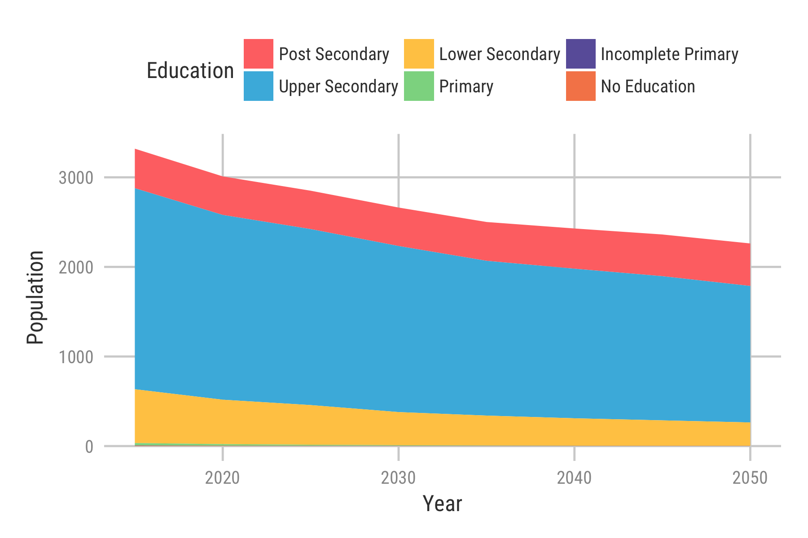

```{r include = FALSE}
knitr::opts_chunk$set(message = FALSE, warning = FALSE)
```

This is a reproducible example to produce a tile map that shows forecasted education attainment for ages 15 to 39 for belt and road countries based on the SSP2 scenario.

## Libraries
```{r setup}
library(tidyverse)
library(geofacet)
library(kani)

source("../grids.R")
options(scipen = 99)
```

**Note:** I have used a library called ```kani``` which has some theme aesthetics for plotting. It can be installed by using ```devtools::install_github("kanishkamisra/kani")``` in your R console.

## Data import

We use data from Wittgenstein Center...

```{r data_import}
belt_road <- read_csv("belt_road_countries.csv")

belt_road <- belt_road %>%
  filter(Education != "Total" & Education != "Under 15" & Year <= 2050) %>%
  group_by(Area, Scenario, Year, Education) %>%
  summarise(Population = sum(Population))

edu_levels <- rev(c("No Education", "Incomplete Primary", "Primary", "Lower Secondary", "Upper Secondary", "Post Secondary"))

belt_road$Education <- factor(belt_road$Education, levels = edu_levels)

# Colors
red = "#ff7473"
blue = "#47b8e0"
yellow = "#ffc952"
green = "#8cd790"
purple = "#6a60a9"
orange = "#f68657"
```

## Plot for one country (SSP2)

As an example, we can plot the forecasted education attainment for ages 15-39 for Hungary. The tile plot introduced in the next section would just be a series of such plots arranged in a specific manner(relative to geographic alignment).

```{r Hungary}
hungary_education <- belt_road %>%
  filter(Area == "Hungary" & Scenario == "SSP2") %>%
  ggplot(aes(Year, Population, group = Education, fill = Education)) + 
  geom_area() +
  scale_fill_manual(values = c(red, blue, yellow, green, purple, orange)) +
  theme_kani() +
  theme(
    legend.position = "top",
    plot.background = element_rect(fill = "white"),
    panel.background = element_rect(fill = "white"),
    legend.background = element_rect(fill = "white"),
    legend.key = element_rect(fill = "white"),
    strip.background = element_rect(fill = "white"),
    strip.text.x = element_text(face = "bold")
  ) + 
  labs(
    Y = "Population per 1000 people"
  )

ggsave("hungary_education.png", hungary_education, height = 4, width = 6)
```


\newpage

## Defining the Grid

In order to implement grids for the ```geofacet``` package to plot the area plots relative to the countries' position on a world map, we define a grid as per ```geofacet```'s guidelines that takes the row and column values as well as identifiers for the countries and aligns the plots accordingly.

The grid for belt and road is shown as follows:

```{r}
obor_grid <- data.frame(
  row = c(1, 1, 2, 2, 3, 3, 3, 3, 3, 4, 4, 4, 4, 4, 4, 4, 4, 5, 5, 5, 5,
          6, 6, 6, 6, 6, 6, 6, 6, 6, 6, 7, 7, 7, 7, 7, 7, 7, 8, 8, 8, 8,
          9, 9, 9, 9, 9, 10, 10, 10, 11),
  col = c(4, 5, 3, 4, 12, 3, 4, 8, 9, 12, 1, 3, 4, 5, 6, 7, 8, 7, 10, 13,
          14, 1, 2, 5, 6, 7, 8, 9, 10, 11, 12, 1, 2, 3, 9, 11, 12, 14, 3,
          5, 8, 12, 3, 4, 5, 11, 14, 4, 5, 11, 3),
  name = c("Poland", "Russia", "Germany", "Hungary", "Mongolia", "Austria", "Serbia",
           "Kazakhstan", "Kyrgyzstan", "China", "Spain", "Italy", "Greece", "Turkey",
           "Georgia", "Uzbekistan", "Tajikistan", "Turkmenistan", "Nepal", "Macao", 
           "Hong Kong", "Senegal", "Mauritania", "Egypt", "Saudi Arabia", "Iran", 
           "Pakistan", "India", "Bangladesh", "Myanmar", "Laos", "Cote d'Ivoire", 
           "Ghana", "Nigeria", "Sri Lanka", "Thailand", "Viet Nam", "Philippines",
           "Cameroon", "Ethiopia", "Maldives", "Cambodia", "Gabon", "Uganda", "Kenya",
           "Malaysia", "Indonesia", "Rwanda", "Tanzania", "Singapore", "Angola"),
  code = c("POL", "RUS", "DEU", "HUN", "MNG", "AUT", "SRB", "KAZ", "KGZ", "CHN", "ESP",
           "ITA", "GRC", "TUR", "GEO", "UZB", "TJK", "TKM", "NPL", "MAC", "HKG", "SEN",
           "MRT", "EGY", "SAU", "IRN", "PAK", "IND", "BGD", "MMR", "LAO", "CIV", "GHA",
           "NGA", "LKA", "THA", "VNM", "PHL", "CMR", "ETH", "MDV", "KHM", "GAB", "UGA",
           "KEN", "MYS", "IDN", "RWA", "TZA", "SGP", "AGO"),
  stringsAsFactors = FALSE
)

knitr::kable(obor_grid)
```

## Grid Preview

```{r obor_grid_prev}
grid_prev <- grid_preview(obor_grid) + theme_minimal()
ggsave("obor_grid.png", grid_prev)
```


\newpage
## Plotting Belt and Road countries

```{r}
belt_road_plot <- belt_road %>%
  filter(Scenario == "SSP2") %>%
  ggplot(aes(Year, Population, fill = Education, group = Education)) + 
    geom_area() + 
    facet_geo(~Area, grid = obor_grid, scales = "free_y", label = "code") +
    theme_kani() + 
    scale_fill_manual(values = c(red, blue, yellow, green, purple, orange)) +
    scale_x_continuous(limits = c(2015,2050)) +
    theme(
      legend.position = "top",
          legend.margin = margin(b = -1, unit = "cm"),
          plot.background = element_rect(fill = "white"),
          panel.background = element_rect(fill = "white"),
          legend.background = element_rect(fill = "white"),
          legend.key = element_rect(fill = "white"),
          strip.background = element_rect(fill = "white"),
          strip.text = element_text(face = "bold"),
          legend.text = element_text(size = rel(1.1)),
          legend.title = element_text(size = rel(1.1))
    ) +
    labs(
      y = "Total population by educational attainment, 000s",
      x = ""
    )

ggsave("belt_road_education.png", belt_road_plot, height = 15, width = 26)
```

\newpage
<!--  -->
\blandscape

Figure 3: Education in the Belt and Road countries (2015 - 2050)
\elandscape
