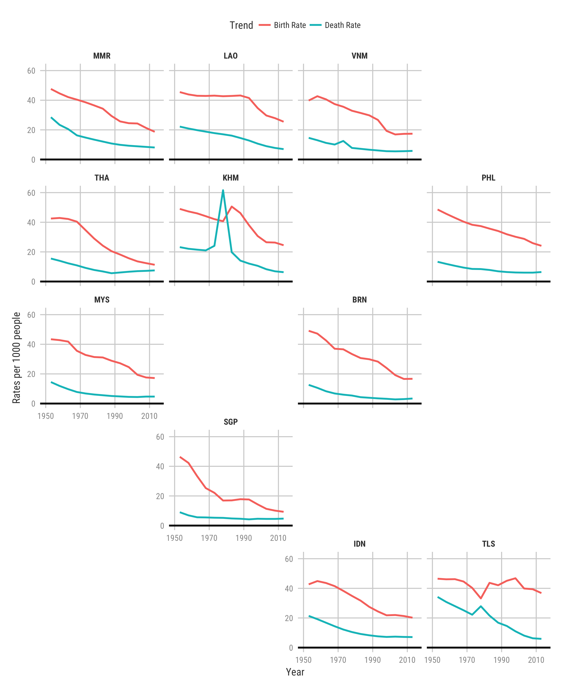

```{r include = FALSE}
knitr::opts_chunk$set(message = FALSE, warning = FALSE)
```

This is a reproducible example to produce a tile map that shows demographic transition (with birth rates and death rates) in the South East Asia region. We use the ```grids.R``` script to load custom grids to align the tiles corresponding to each country's graph. These are all region based and we will be using the ```sea_grid``` grid for the plot produced in this analysis.

## Libraries
```{r setup}
library(tidyverse)
library(geofacet)
library(kani)

source("../grids.R")
options(scipen = 99)
```

**Note:** I have used a library called ```kani``` which has some theme aesthetics for plotting. It can be installed by using ```devtools::install_github("kanishkamisra/kani")``` in your R console.

## Data import

We use data from <blank> that contains aggregated birth and death rates (5 years aggregation) from 1950-1955 to 2010-2015

```{r data_import}
birth_rates <- read_csv("Birth_rates.csv")
death_rates <- read_csv("Death_rates.csv")

birth_rates <- birth_rates %>%
  gather(`1950-1955`:`2010-2015`, key = "year", value = "birth_rate")

death_rates <- death_rates %>%
  gather(`1950-1955`:`2010-2015`, key = "year", value = "death_rate")

demographic_transition <- birth_rates %>%
  inner_join(death_rates)

demographic_transition
```

## Wrangling

Since the years are formatted in 5 year intervals, we use the year at the mid point, rounded to the next whole number to indicate year (makes it easy to add labels to axis). For example, 1952.5 becomes 1953 for 1950-1955

```{r year_fix}
get_year <- function(years) {
  return(ceiling(mean(as.numeric(str_split(years, "-")[[1]]))))
}

demographic_transition <- demographic_transition %>%
  mutate(
    year = map_dbl(year, get_year)
  )

demographic_transition
```

## Plotting demographic transition for one country

We can take the example of Thailand's birth and death rates as an example to show demographic transition in the country.

```{r thailand-dt}
thailand_dt <- demographic_transition %>%
  filter(Country == "Thailand") %>%
  gather(birth_rate:death_rate, key = "Trend", value = "Rate") %>%
  mutate(Trend = str_to_title(str_replace(Trend, "_", " "))) %>%
  ggplot(aes(year, Rate, color = Trend, group = Trend)) +
  geom_line(size = 1) + 
  geom_hline(yintercept = 0, size = 1) +
  scale_x_continuous(breaks = seq(1950, 2010, by = 10)) + 
  theme_kani() + 
  theme(
    legend.position = "top",
    plot.background = element_rect(fill = "white"),
    panel.background = element_rect(fill = "white"),
    legend.background = element_rect(fill = "white"),
    legend.key = element_rect(fill = "white"),
    strip.background = element_rect(fill = "white"),
    strip.text.x = element_text(face = "bold")
  ) + 
  labs(
    y = "Rates per 1000 people",
    x = "Year"
  )

ggsave("thailand_dt.png", thailand_dt, height = 4, width = 6)
```

\newpage

## Plotting Demographic Transition in SEA

We now use the ```geofacet``` package to plot birth and death rates in the South East Asia region. The ```sea_grid``` in ```grids.R``` helps us make a grid for the region which can fit any static, 2D plot as tiles that represent countries in SEA.

```{r sea-dt}
regional_plot <- function(region_grid) {
  plot <- demographic_transition %>%
    filter(Country %in% region_grid$name) %>%
    gather(birth_rate:death_rate, key = "Trend", value = "Rate") %>%
    mutate(Trend = str_to_title(str_replace(Trend, "_", " "))) %>%
    ggplot(aes(year, Rate, color = Trend, group = Trend)) +
    geom_line(size = 1) + 
    geom_hline(yintercept = 0, size = 1) +
    facet_geo(~Country, grid = region_grid, label = "code") +
    scale_x_continuous(breaks = seq(1950, 2010, by = 20), limits = c(1950, 2015)) + 
    theme_kani() + 
    theme(
      legend.position = "top",
      plot.background = element_rect(fill = "white"),
      panel.background = element_rect(fill = "white"),
      legend.background = element_rect(fill = "white"),
      legend.key = element_rect(fill = "white"),
      strip.background = element_rect(fill = "white"),
      strip.text.x = element_text(face = "bold")
    ) +
    labs(
      y = "Rates per 1000 people",
      x = "Year"
    )
  
  return(plot)
}

ggsave("sea_dt.png", regional_plot(sea_grid), height = 11, width = 9)
```

This produces the plot:


