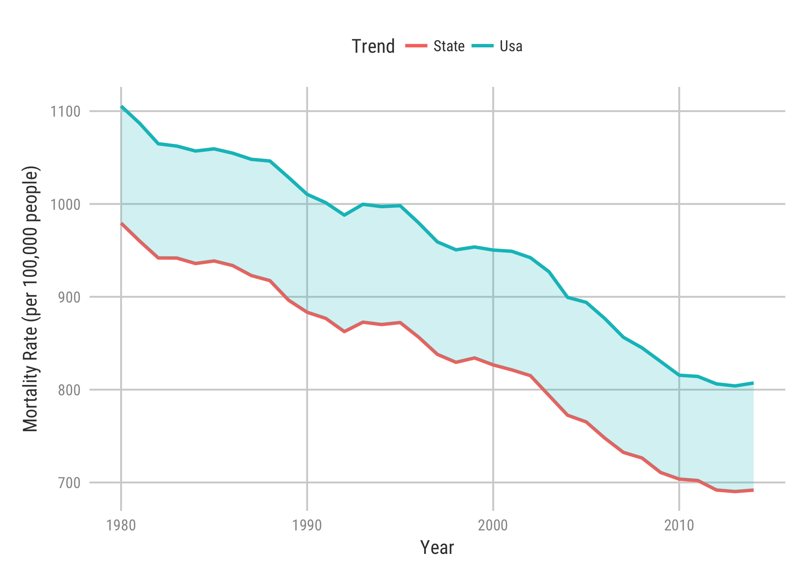

```{r include = FALSE}
knitr::opts_chunk$set(message = FALSE, warning = FALSE)
```

This is a reproducible example to produce a tile map that shows mortality rates in the USA.

## Libraries
```{r setup}
library(tidyverse)
library(geofacet)
library(kani)

options(scipen = 99)
```

**Note:** I have used a library called ```kani``` which has some theme aesthetics for plotting. It can be installed by using ```devtools::install_github("kanishkamisra/kani")``` in your R console.

## Data import

We use data from IMHE's website that has gender-specific data about mortality rates due to different causes in the USA and its counties. We will only be dealing with mortality rates due to all causes in all states (present along with the counties) of the US(Including Hawaii and District of Columbia). 

```{r data import}
files <- list.files(pattern = '*.CSV', full.names = T, recursive = T)

mortality <- map_df(files, read_csv)

states <- data.frame(
  state_abb = c(state.abb, "DC"),
  location_name = c(state.name, "District of Columbia")
)

mortality <- mortality %>%
  filter(location_name %in% state.name | location_name == "District of Columbia") %>%
  filter(cause_name == "All causes" & sex == "Both") %>%
  inner_join(states)
```

## US Average for each year

```{r usa_vs_state}
usa_vs_state <- mortality %>%
  group_by(year_id) %>%
  mutate(usa_avg = mean(mx)) %>%
  ungroup() %>%
  select(
    state = location_name,
    state_abb,
    year = year_id,
    state_avg = mx,
    usa_avg
  ) %>%
  mutate(
    ribbon_color = case_when(
       state_avg > usa_avg ~ "#f8766d",
      usa_avg > state_avg ~ "#00bfc4"
    ),
    ribbon_value = case_when(
      state_avg > usa_avg ~ state_avg,
      usa_avg > state_avg ~ usa_avg,
      TRUE ~ state_avg
    )
  )
```

To produce the plot, we use the ```geom_ribbon``` function to show more a more apparent difference in the state vs the usa average mortality due to all causes. The ribbon is essentially a color fill between the two line plots of the state mortality rates and the usa average. The color is determined by which rate is greater (worse in the case of mortality).

# For one state

We can take look at the plot for Minnesota

```{r minnesota_mortality}
minnesota <- usa_vs_state %>%
  filter(state == "Minnesota") %>%
  gather(state_avg, usa_avg, key = "metric", value = "mortality_rate") %>%
  separate(metric, into = c("metric", "avg")) %>%
  mutate(metric = str_to_title(metric)) %>%
  select(-avg) %>%
  ggplot(aes(year, mortality_rate, color = metric)) +
  geom_line(size = 1) +
  geom_ribbon(aes(ymin = mortality_rate, ymax = ribbon_value,
                  linetype = NA, fill = ribbon_color), alpha = 0.2, show.legend = F) +
  scale_fill_identity() +
  theme_kani() +
  theme(
    legend.position = "top",
    plot.background = element_rect(fill = "white"),
    panel.background = element_rect(fill = "white"),
    legend.background = element_rect(fill = "white"),
    legend.key = element_rect(fill = "white"),
    strip.background = element_rect(fill = "white"),
    strip.text = element_text(face = "bold")
  ) +
  labs(
    x = "Year",
    y = "Mortality Rate (per 100,000 people)",
    color = "Trend"
  )

ggsave("minnesota_mortality.png", minnesota)
```


## USA Grid

We use the ```grid_design()``` function to design the grid for United States, this function call opens a new window where the following values can be added in a comma separated format.

```{r table, echo = FALSE}
knitr::kable(us_state_grid4)
```


## Grid Preview

We use the ```grid_preview("us_state_grid4")``` to preview the grid as shown below

```{r usa_grid_preview}
grid_prev <- grid_preview(us_state_grid4) + theme_minimal()

ggsave("usa_grid.png", grid_prev, height = 7, width = 9)
grid_prev
```

\newpage
## Plotting mortality rates in USA as a grid map

We now take the grid and code the plots similar to the one shown for minnesota, but this time for all states.

```{r plot}
usa_state_plot <- usa_vs_state %>%
  gather(state_avg, usa_avg, key = "metric", value = "mortality_rate") %>%
  separate(metric, into = c("metric", "avg")) %>%
  mutate(metric = str_to_title(metric)) %>%
  select(-avg) %>%
  ggplot(aes(year, mortality_rate, color = metric)) +
  geom_line(size = 1) +
  geom_ribbon(aes(ymin = mortality_rate, ymax = ribbon_value,
                  linetype = NA, fill = ribbon_color), alpha = 0.2, show.legend = F) +
  facet_geo(~state_abb, grid = "us_state_grid4") +
  scale_fill_identity() +
  theme_kani() +
  theme(
    legend.position = "top",
    legend.margin = margin(b = -1, unit = "cm"),
    plot.background = element_rect(fill = "white"),
    panel.background = element_rect(fill = "white"),
    legend.background = element_rect(fill = "white"),
    legend.key = element_rect(fill = "white"),
    strip.background = element_rect(fill = "white"),
    strip.text = element_text(face = "bold"),
    legend.text = element_text(size = rel(1.2)),
    legend.title = element_text(size = rel(1.2))
  ) +
  labs(
    x = "Year",
    y = "Mortality Rate (per 100,000 people)",
    color = "Trend"
  )

ggsave("usa_state_mortality.png", usa_state_plot, height = 12, width = 15)

```


\newpage
## References

Institute for Health Metrics and Evaluation (IHME). United States Mortality Rates by County 1980-2014. Seattle,   United States: Institute for Health Metrics and Evaluation (IHME), 2016.

H. Wickham. ggplot2: Elegant Graphics for Data Analysis. Springer-Verlag New York, 2016.

Ryan Hafen (2017). geofacet: 'ggplot2' Faceting Utilities for Geographical Data. R package version
  0.1.5. https://CRAN.R-project.org/package=geofacet