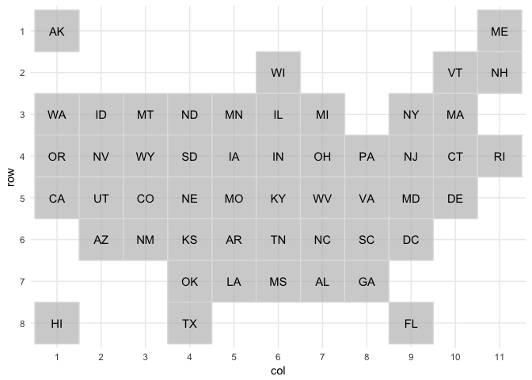
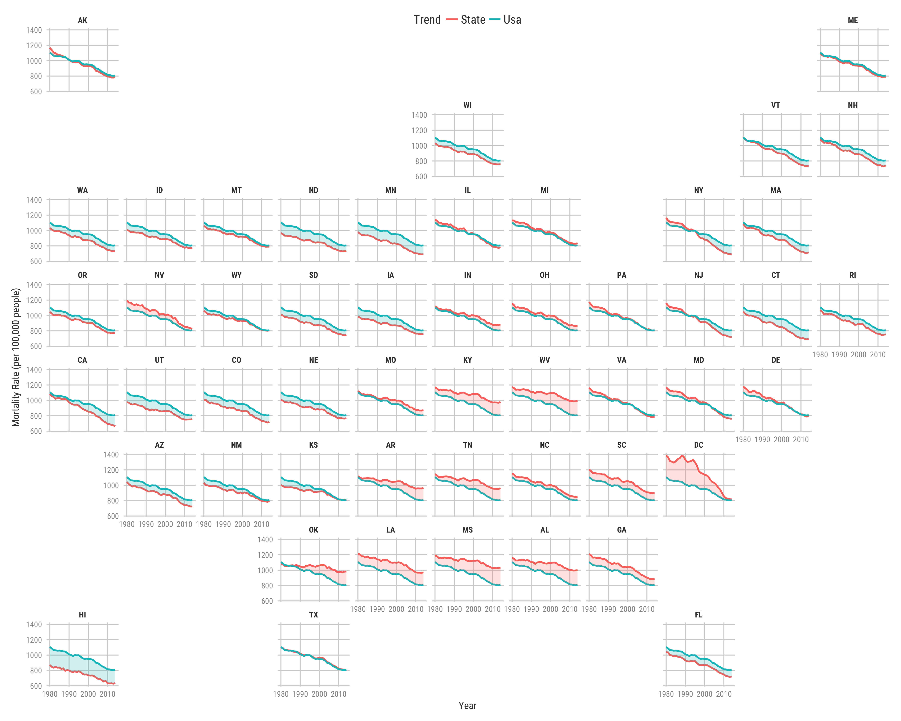

This is a reproducible example to produce a tile map that shows
mortality rates in the USA.

Libraries
---------

    library(tidyverse)
    library(geofacet)
    library(kani)

    options(scipen = 99)

**Note:** I have used a library called `kani` which has some theme
aesthetics for plotting. It can be installed by using
`devtools::install_github("kanishkamisra/kani")` in your R console.

Data import
-----------

We use data from IMHE's website that has gender-specific data about
mortality rates due to different causes in the USA and its counties. We
will only be dealing with mortality rates due to all causes in all
states (present along with the counties) of the US(Including Hawaii and
District of Columbia).

    files <- list.files(pattern = '*.CSV', full.names = T, recursive = T)

    mortality <- map_df(files, read_csv)

    states <- data.frame(
      state_abb = c(state.abb, "DC"),
      location_name = c(state.name, "District of Columbia")
    )

    mortality <- mortality %>%
      filter(location_name %in% state.name | location_name == "District of Columbia") %>%
      filter(cause_name == "All causes" & sex == "Both") %>%
      inner_join(states)

US Average for each year
------------------------

    usa_vs_state <- mortality %>%
      group_by(year_id) %>%
      mutate(usa_avg = mean(mx)) %>%
      ungroup() %>%
      select(
        state = location_name,
        state_abb,
        year = year_id,
        state_avg = mx,
        usa_avg
      ) %>%
      mutate(
        ribbon_color = case_when(
           state_avg > usa_avg ~ "#f8766d",
          usa_avg > state_avg ~ "#00bfc4"
        ),
        ribbon_value = case_when(
          state_avg > usa_avg ~ state_avg,
          usa_avg > state_avg ~ usa_avg,
          TRUE ~ state_avg
        )
      )

To produce the plot, we use the `geom_ribbon` function to show more a
more apparent difference in the state vs the usa average mortality due
to all causes. The ribbon is essentially a color fill between the two
line plots of the state mortality rates and the usa average. The color
is determined by which rate is greater (worse in the case of mortality).

For one state
=============

We can take look at the plot for Minnesota

    minnesota <- usa_vs_state %>%
      filter(state == "Minnesota") %>%
      gather(state_avg, usa_avg, key = "metric", value = "mortality_rate") %>%
      separate(metric, into = c("metric", "avg")) %>%
      mutate(metric = str_to_title(metric)) %>%
      select(-avg) %>%
      ggplot(aes(year, mortality_rate, color = metric)) +
      geom_line(size = 1) +
      geom_ribbon(aes(ymin = mortality_rate, ymax = ribbon_value,
                      linetype = NA, fill = ribbon_color), alpha = 0.2, show.legend = F) +
      scale_fill_identity() +
      theme_kani() +
      theme(
        legend.position = "top",
        plot.background = element_rect(fill = "white"),
        panel.background = element_rect(fill = "white"),
        legend.background = element_rect(fill = "white"),
        legend.key = element_rect(fill = "white"),
        strip.background = element_rect(fill = "white"),
        strip.text = element_text(face = "bold")
      ) +
      labs(
        x = "Year",
        y = "Mortality Rate (per 100,000 people)",
        color = "Trend"
      )

    ggsave("minnesota_mortality.png", minnesota)

USA Grid
--------

We use the `grid_design()` function to design the grid for United
States, this function call opens a new window where the following values
can be added in a comma separated format.

<table>
<thead>
<tr class="header">
<th align="right">row</th>
<th align="right">col</th>
<th align="left">code</th>
<th align="left">name</th>
</tr>
</thead>
<tbody>
<tr class="odd">
<td align="right">1</td>
<td align="right">11</td>
<td align="left">ME</td>
<td align="left">Maine</td>
</tr>
<tr class="even">
<td align="right">1</td>
<td align="right">1</td>
<td align="left">AK</td>
<td align="left">Alaska</td>
</tr>
<tr class="odd">
<td align="right">2</td>
<td align="right">11</td>
<td align="left">NH</td>
<td align="left">New Hampshire</td>
</tr>
<tr class="even">
<td align="right">2</td>
<td align="right">10</td>
<td align="left">VT</td>
<td align="left">Vermont</td>
</tr>
<tr class="odd">
<td align="right">2</td>
<td align="right">6</td>
<td align="left">WI</td>
<td align="left">Wisconsin</td>
</tr>
<tr class="even">
<td align="right">3</td>
<td align="right">2</td>
<td align="left">ID</td>
<td align="left">Idaho</td>
</tr>
<tr class="odd">
<td align="right">3</td>
<td align="right">6</td>
<td align="left">IL</td>
<td align="left">Illinois</td>
</tr>
<tr class="even">
<td align="right">3</td>
<td align="right">10</td>
<td align="left">MA</td>
<td align="left">Massachusetts</td>
</tr>
<tr class="odd">
<td align="right">3</td>
<td align="right">7</td>
<td align="left">MI</td>
<td align="left">Michigan</td>
</tr>
<tr class="even">
<td align="right">3</td>
<td align="right">5</td>
<td align="left">MN</td>
<td align="left">Minnesota</td>
</tr>
<tr class="odd">
<td align="right">3</td>
<td align="right">3</td>
<td align="left">MT</td>
<td align="left">Montana</td>
</tr>
<tr class="even">
<td align="right">3</td>
<td align="right">9</td>
<td align="left">NY</td>
<td align="left">New York</td>
</tr>
<tr class="odd">
<td align="right">3</td>
<td align="right">4</td>
<td align="left">ND</td>
<td align="left">North Dakota</td>
</tr>
<tr class="even">
<td align="right">3</td>
<td align="right">1</td>
<td align="left">WA</td>
<td align="left">Washington</td>
</tr>
<tr class="odd">
<td align="right">4</td>
<td align="right">10</td>
<td align="left">CT</td>
<td align="left">Connecticut</td>
</tr>
<tr class="even">
<td align="right">4</td>
<td align="right">6</td>
<td align="left">IN</td>
<td align="left">Indiana</td>
</tr>
<tr class="odd">
<td align="right">4</td>
<td align="right">5</td>
<td align="left">IA</td>
<td align="left">Iowa</td>
</tr>
<tr class="even">
<td align="right">4</td>
<td align="right">2</td>
<td align="left">NV</td>
<td align="left">Nevada</td>
</tr>
<tr class="odd">
<td align="right">4</td>
<td align="right">9</td>
<td align="left">NJ</td>
<td align="left">New Jersey</td>
</tr>
<tr class="even">
<td align="right">4</td>
<td align="right">7</td>
<td align="left">OH</td>
<td align="left">Ohio</td>
</tr>
<tr class="odd">
<td align="right">4</td>
<td align="right">1</td>
<td align="left">OR</td>
<td align="left">Oregon</td>
</tr>
<tr class="even">
<td align="right">4</td>
<td align="right">8</td>
<td align="left">PA</td>
<td align="left">Pennsylvania</td>
</tr>
<tr class="odd">
<td align="right">4</td>
<td align="right">11</td>
<td align="left">RI</td>
<td align="left">Rhode Island</td>
</tr>
<tr class="even">
<td align="right">4</td>
<td align="right">4</td>
<td align="left">SD</td>
<td align="left">South Dakota</td>
</tr>
<tr class="odd">
<td align="right">4</td>
<td align="right">3</td>
<td align="left">WY</td>
<td align="left">Wyoming</td>
</tr>
<tr class="even">
<td align="right">5</td>
<td align="right">1</td>
<td align="left">CA</td>
<td align="left">California</td>
</tr>
<tr class="odd">
<td align="right">5</td>
<td align="right">3</td>
<td align="left">CO</td>
<td align="left">Colorado</td>
</tr>
<tr class="even">
<td align="right">5</td>
<td align="right">10</td>
<td align="left">DE</td>
<td align="left">Delaware</td>
</tr>
<tr class="odd">
<td align="right">5</td>
<td align="right">6</td>
<td align="left">KY</td>
<td align="left">Kentucky</td>
</tr>
<tr class="even">
<td align="right">5</td>
<td align="right">9</td>
<td align="left">MD</td>
<td align="left">Maryland</td>
</tr>
<tr class="odd">
<td align="right">5</td>
<td align="right">5</td>
<td align="left">MO</td>
<td align="left">Missouri</td>
</tr>
<tr class="even">
<td align="right">5</td>
<td align="right">4</td>
<td align="left">NE</td>
<td align="left">Nebraska</td>
</tr>
<tr class="odd">
<td align="right">5</td>
<td align="right">2</td>
<td align="left">UT</td>
<td align="left">Utah</td>
</tr>
<tr class="even">
<td align="right">5</td>
<td align="right">8</td>
<td align="left">VA</td>
<td align="left">Virginia</td>
</tr>
<tr class="odd">
<td align="right">5</td>
<td align="right">7</td>
<td align="left">WV</td>
<td align="left">West Virginia</td>
</tr>
<tr class="even">
<td align="right">6</td>
<td align="right">2</td>
<td align="left">AZ</td>
<td align="left">Arizona</td>
</tr>
<tr class="odd">
<td align="right">6</td>
<td align="right">5</td>
<td align="left">AR</td>
<td align="left">Arkansas</td>
</tr>
<tr class="even">
<td align="right">6</td>
<td align="right">4</td>
<td align="left">KS</td>
<td align="left">Kansas</td>
</tr>
<tr class="odd">
<td align="right">6</td>
<td align="right">3</td>
<td align="left">NM</td>
<td align="left">New Mexico</td>
</tr>
<tr class="even">
<td align="right">6</td>
<td align="right">7</td>
<td align="left">NC</td>
<td align="left">North Carolina</td>
</tr>
<tr class="odd">
<td align="right">6</td>
<td align="right">8</td>
<td align="left">SC</td>
<td align="left">South Carolina</td>
</tr>
<tr class="even">
<td align="right">6</td>
<td align="right">6</td>
<td align="left">TN</td>
<td align="left">Tennessee</td>
</tr>
<tr class="odd">
<td align="right">6</td>
<td align="right">9</td>
<td align="left">DC</td>
<td align="left">District of Columbia</td>
</tr>
<tr class="even">
<td align="right">7</td>
<td align="right">7</td>
<td align="left">AL</td>
<td align="left">Alabama</td>
</tr>
<tr class="odd">
<td align="right">7</td>
<td align="right">8</td>
<td align="left">GA</td>
<td align="left">Georgia</td>
</tr>
<tr class="even">
<td align="right">7</td>
<td align="right">5</td>
<td align="left">LA</td>
<td align="left">Louisiana</td>
</tr>
<tr class="odd">
<td align="right">7</td>
<td align="right">6</td>
<td align="left">MS</td>
<td align="left">Mississippi</td>
</tr>
<tr class="even">
<td align="right">7</td>
<td align="right">4</td>
<td align="left">OK</td>
<td align="left">Oklahoma</td>
</tr>
<tr class="odd">
<td align="right">8</td>
<td align="right">9</td>
<td align="left">FL</td>
<td align="left">Florida</td>
</tr>
<tr class="even">
<td align="right">8</td>
<td align="right">1</td>
<td align="left">HI</td>
<td align="left">Hawaii</td>
</tr>
<tr class="odd">
<td align="right">8</td>
<td align="right">4</td>
<td align="left">TX</td>
<td align="left">Texas</td>
</tr>
</tbody>
</table>

Grid Preview
------------

We use the `grid_preview("us_state_grid4")` to preview the grid as shown
below

    grid_prev <- grid_preview(us_state_grid4) + theme_minimal()

    ggsave("usa_grid.png", grid_prev, height = 7, width = 9)
    grid_prev

Plotting mortality rates in USA as a grid map
---------------------------------------------

We now take the grid and code the plots similar to the one shown for
minnesota, but this time for all states.

    usa_state_plot <- usa_vs_state %>%
      gather(state_avg, usa_avg, key = "metric", value = "mortality_rate") %>%
      separate(metric, into = c("metric", "avg")) %>%
      mutate(metric = str_to_title(metric)) %>%
      select(-avg) %>%
      ggplot(aes(year, mortality_rate, color = metric)) +
      geom_line(size = 1) +
      geom_ribbon(aes(ymin = mortality_rate, ymax = ribbon_value,
                      linetype = NA, fill = ribbon_color), alpha = 0.2, show.legend = F) +
      facet_geo(~state_abb, grid = "us_state_grid4") +
      scale_fill_identity() +
      theme_kani() +
      theme(
        legend.position = "top",
        legend.margin = margin(b = -1, unit = "cm"),
        plot.background = element_rect(fill = "white"),
        panel.background = element_rect(fill = "white"),
        legend.background = element_rect(fill = "white"),
        legend.key = element_rect(fill = "white"),
        strip.background = element_rect(fill = "white"),
        strip.text = element_text(face = "bold"),
        legend.text = element_text(size = rel(1.2)),
        legend.title = element_text(size = rel(1.2))
      ) +
      labs(
        x = "Year",
        y = "Mortality Rate (per 100,000 people)",
        color = "Trend"
      )

    ggsave("usa_state_mortality.png", usa_state_plot, height = 12, width = 15)

References
----------

Institute for Health Metrics and Evaluation (IHME). United States
Mortality Rates by County 1980-2014. Seattle, United States: Institute
for Health Metrics and Evaluation (IHME), 2016.

H. Wickham. ggplot2: Elegant Graphics for Data Analysis. Springer-Verlag
New York, 2016.

Ryan Hafen (2017). geofacet: 'ggplot2' Faceting Utilities for
Geographical Data. R package version 0.1.5.
<https://CRAN.R-project.org/package=geofacet>
